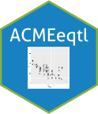

joineRML 
  =====================================================================================
    
    # ACMEeqtl: Estimation of Interpretable eQTL Effect Sizes Using a Log of Linear Model
    
    We use a non-linear model, termed ACME,
  

